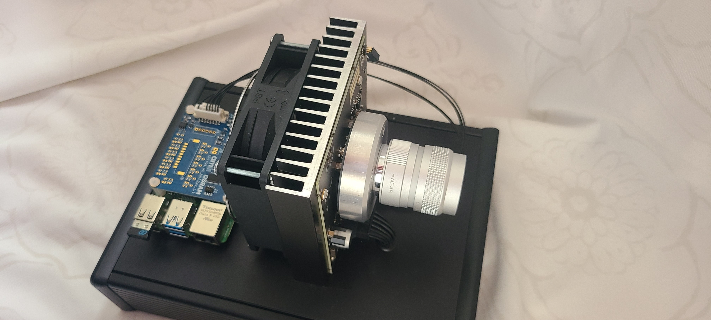

# Pygame Programm mit VSCODE erstellen. Spiele mit dem NVIOS Projektor projizieren.  
# Inhaltsverzeichnis

- [Pygame Programm mit VSCODE erstellen. Spiele mit dem NVIOS Projektor projizieren.](#pygame-programm-mit-vscode-erstellen-spiele-mit-dem-nvios-projektor-projizieren)
- [Teil 1: Python auf dem Raspberry einrichten und mit Vsiual Studio Code editieren](#teil-1-python-auf-dem-raspberry-einrichten-und-mit-vsiual-studio-code-editieren)
    - [1. Projektverzeichnis erstellen und betreten](#1-projektverzeichnis-erstellen-und-betreten)
    - [2. Python-Umgebung einrichten](#2-python-umgebung-einrichten)
    - [3. Abhängigkeiten installieren](#3-abhängigkeiten-installieren)
    - [4. Einfaches Programm mainpy erstellen](#4-einfaches-programm-mainpy-erstellen)
    - [5. Das einfache Programm ausführen](#5-das-einfache-programm-ausführen)
- [Teil 2: Arbeiten mit Pygame](#teil-2-arbeiten-mit-pygame)
    - [Minimales Pygame-Programm](#minimales-pygame-programm)
    - [Schritt-für-Schritt: Elemente zum pygame Bildschirm hinzufügen](#schritt-für-schritt-elemente-zum-pygame-bildschirm-hinzufügen)
        - [Schritt 1: Ein Rechteck zeichnen](#schritt-1-ein-rechteck-zeichnen)
        - [Schritt 2: Einen Kreis zeichnen](#schritt-2-einen-kreis-zeichnen)
        - [Schritt 3: Text anzeigen](#schritt-3-text-anzeigen)
        - [Schritt 4: Bewegte Elemente (Animation)](#schritt-4-bewegte-elemente-animation)
        - [Schritt 5: Ein Rechteck mit der Tastatur bewegen](#schritt-5-ein-rechteck-mit-der-tastatur-bewegen)
    - [Beispiel: Einfaches Pong-Spiel](#beispiel-einfaches-pong-spiel)
- [Teil 3: Projektion mit dem EVIYOS Projektor](#teil-3-projektion-mit-dem-eviyos-projektor)


### Herzlichen Dank
| Ein herzliches Dankeschön an Dr. Norwin von Malm und Stefan Grötsch – die Preisträger des [Deutschen Zukunftspreises 2024](https://www.deutscher-zukunftspreis.de/de/team-1-2024).<br>Mit ihrer Spende und ihrer großzügigen Unterstützung haben Sie die Entwicklung und Durchführung dieses Kurses ermöglicht. |  |
|:---|:---:|


# Teil 1: Python Projekt auf dem Raspberry Pi erstellen. Mit Visual Studio Code programmieren 
## Projektverzeichnis erstellen und betreten
Erstelle dein Projektverzeichnis und wechsle hinein (Beispiel: `~/Mintlabs/python-mit-projektor`):

```bash
mkdir -p ~/Mintlabs/python-mit-projektor
cd ~/Mintlabs/python-mit-projektor
```

### Visual Studio Code im Verzeichnis öffnen und Terminal benutzen

Öffne Visual Studio Code im Projektverzeichnis:

```bash
code .
```
Wichtig: nach code kommt ein Leerzeichen und dann der Punkt!

Das integrierte Terminal in Visual Studio Code öffnest du mit `Strg + ö` (oder über das Menü: Terminal → Neues Terminal). Hier kannst du alle weiteren Befehle direkt ausführen.

## Python-Umgebung .venv einrichten
Es wird empfohlen, eine virtuelle Umgebung zu verwenden:

```bash
cd ~/Mintlabs/python-mit-projektor
python3 -m venv .venv
source .venv/bin/activate
```

## Abhängigkeiten installieren
Installiere die pygame und numpy library. Du brauchst sie später bei `import pygame`.

```bash
pip install pygame numpy pyserial pandas pillow openpyxl
```


## Einfaches Programm `main.py` erstellen

Erstelle eine minimale Datei namens `main.py` mit folgendem Inhalt:

```python
print("Hello World!")
```

## Das einfache Programm ausführen
Du kannst das Programm `main.py` auf verschiedene Arten starten:

- Über das Menü: **Ausführen → Ohne Debugging starten**
- Über das Run-Symbol oben rechts im Editor
- Oder im Terminal mit:

```bash
python main.py
```


Du siehst `Hello World!`im Terminal. 


---
# Teil 2: Arbeiten mit Pygame
Pygame ist eine Sammlung von Python-Modulen zum Schreiben von Videospielen und Multimedia-Anwendungen. Es bietet Funktionen zum Erstellen von Fenstern, Zeichnen von Formen, Verarbeiten von Eingaben, Abspielen von Sounds und mehr. Siehe die [Pygame-Dokumentation](https://www.pygame.org/docs/) für Details.

## Minimales Pygame-Programm
```python
import pygame

pygame.init()
screen = pygame.display.set_mode((640, 480))
pygame.display.set_caption('Mein Pygame')
running = True
while running:
    for event in pygame.event.get():
        if event.type == pygame.QUIT:
            running = False
    screen.fill((0, 0, 0))
    pygame.display.flip()
pygame.quit()
```

## Schritt-für-Schritt: Elemente zum pygame Bildschirm hinzufügen
Nach dem Setup kannst du Elemente zu deinem Pygame-Fenster hinzufügen.

### Schritt 1: Ein Rechteck zeichnen
Füge Folgendes in deine Hauptschleife ein, vor `pygame.display.flip()`:

```python
pygame.draw.rect(screen, (0, 128, 255), (50, 50, 150, 80))
```

### Schritt 2: Einen Kreis zeichnen
Füge dies nach dem Rechteck-Code ein:

```python
pygame.draw.circle(screen, (255, 0, 0), (320, 240), 40)
```

### Schritt 3: Text anzeigen
Um Text anzuzeigen, füge dies vor deiner Hauptschleife ein:

```python
font = pygame.font.SysFont(None, 48)
```
Und in deiner Hauptschleife, nach dem Zeichnen der Formen:

```python
text = font.render('Hello, Pygame!', True, (255, 255, 255))
screen.blit(text, (200, 400))
```


## Schritt 4: Bewegte Elemente (Animation)
Du kannst Elemente animieren, indem du ihre Position in jedem Frame aktualisierst. Hier ein Beispiel für ein bewegtes Rechteck:

```python
import pygame

pygame.init()
screen = pygame.display.set_mode((640, 480))
pygame.display.set_caption('Bewegendes Rechteck')

x = 0
y = 200
speed = 3
running = True
while running:
    for event in pygame.event.get():
        if event.type == pygame.QUIT:
            running = False
    screen.fill((0, 0, 0))
    pygame.draw.rect(screen, (0, 128, 255), (x, y, 100, 50))
    x += speed
    if x > 640:
        x = -100  # Zurück zum linken Rand
    pygame.display.flip()
    pygame.time.delay(16)  # ~60 FPS
pygame.quit()
```

Dieses Rechteck bewegt sich horizontal über den Bildschirm und springt zurück, wenn es den Rand erreicht. Du kannst Kreise, Bilder oder andere Elemente auf ähnliche Weise animieren, indem du ihre Koordinaten in jedem Frame aktualisierst.

## Schritt 5: Ein Rechteck mit der Tastatur bewegen

Du kannst ein Rechteck mit den Pfeiltasten steuern, indem du die Tastatureingaben abfragst und die Position entsprechend anpasst:

```python
import pygame

pygame.init()
screen = pygame.display.set_mode((640, 480))
pygame.display.set_caption('Rechteck mit Tastatur bewegen')

x = 320
y = 240
speed = 5
running = True
while running:
    for event in pygame.event.get():
        if event.type == pygame.QUIT:
            running = False

    keys = pygame.key.get_pressed()
    if keys[pygame.K_LEFT]:
        x -= speed
    if keys[pygame.K_RIGHT]:
        x += speed
    if keys[pygame.K_UP]:
        y -= speed
    if keys[pygame.K_DOWN]:
        y += speed

    screen.fill((0, 0, 0))
    pygame.draw.rect(screen, (0, 255, 0), (x, y, 60, 40))
    pygame.display.flip()
    pygame.time.delay(16)  # ~60 FPS

pygame.quit()
```

Mit den Pfeiltasten kannst du das grüne Rechteck auf dem Bildschirm bewegen.

## Beispiel: Pong-Spiel
Hier ist ein Pong-Spiel mit Pygame:

```python
import pygame

pygame.init()
screen = pygame.display.set_mode((800, 600))
pygame.display.set_caption('Pong')

# Farben
WHITE = (255, 255, 255)
BLACK = (0, 0, 0)

# Ball-Startposition und Geschwindigkeit
ball_x = 400
ball_y = 300
ball_dx = 4
ball_dy = 4

# Schläger
paddle_width = 10
paddle_height = 100
paddle1_y = 250
paddle2_y = 250
paddle_speed = 6

clock = pygame.time.Clock()
running = True
while running:
    for event in pygame.event.get():
        if event.type == pygame.QUIT:
            running = False

    keys = pygame.key.get_pressed()
    if keys[pygame.K_w]:
        paddle1_y -= paddle_speed
    if keys[pygame.K_s]:
        paddle1_y += paddle_speed
    if keys[pygame.K_UP]:
        paddle2_y -= paddle_speed
    if keys[pygame.K_DOWN]:
        paddle2_y += paddle_speed

    # Ball bewegen
    ball_x += ball_dx
    ball_y += ball_dy

    # Ball an obere/untere Wand abprallen lassen
    if ball_y <= 0 or ball_y >= 600 - 10:
        ball_dy = -ball_dy

    # Ball an Schläger abprallen lassen
    if (ball_x <= paddle_width and paddle1_y < ball_y < paddle1_y + paddle_height) or \
       (ball_x >= 800 - paddle_width - 10 and paddle2_y < ball_y < paddle2_y + paddle_height):
        ball_dx = -ball_dx

    # Ball zurücksetzen, wenn er aus dem Feld geht
    if ball_x < 0 or ball_x > 800:
        ball_x, ball_y = 400, 300
        ball_dx = -ball_dx

    screen.fill(BLACK)
    pygame.draw.rect(screen, WHITE, (0, paddle1_y, paddle_width, paddle_height))
    pygame.draw.rect(screen, WHITE, (800 - paddle_width, paddle2_y, paddle_width, paddle_height))
    pygame.draw.ellipse(screen, WHITE, (ball_x, ball_y, 10, 10))
    pygame.display.flip()
    clock.tick(60)

pygame.quit()
```

Mit W/S (links) und Pfeil hoch/runter (rechts) steuerst du die Schläger.

# Teil 3: Projektion mit dem EVIYOS Projektor



Der OSRAM EVIYOS ist ein intelligenter, programmierbarer LED-Matrix-Projektor mit 25.600 einzeln ansteuerbaren LEDs, der für hochauflösende, flexible Lichtprojektionen entwickelt wurde. Er ermöglicht die gezielte Steuerung einzelner Pixel und wird u.a. in der Automobilbeleuchtung und für innovative Lichtanwendungen eingesetzt.

Kopiere die dateien 
RaspberryPiEVIYOS.py ins Verzeichnis helpers
VIA_FPGA_Register_EV2.xlsx ins Verzeichnis /data

```bash
cp ~/Mintlabs/evios-library/RaspberryPiEVIYOS.py ~/Mintlabs/python-mit-projektor/helpers
cp ~/Mintlabs/evios-library/VIA_FPGA_Register_EV2.xlsx ~/Mintlabs/python-mit-projektor/data
```

